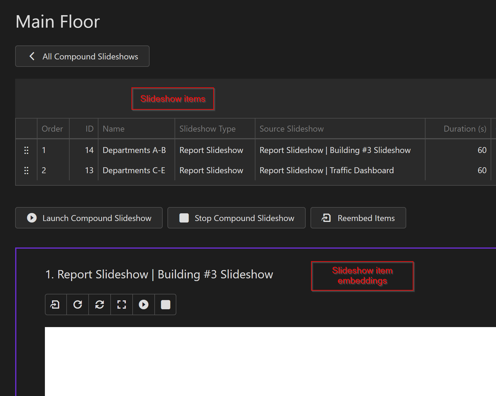
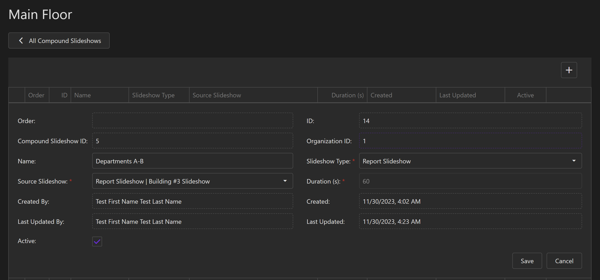
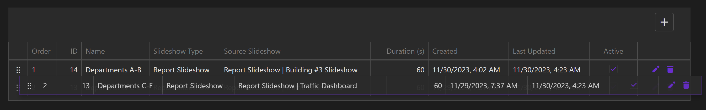

# Build a Compound Slideshow

This section explains how to build each atomic piece of a Compound Slideshow. To see top-level configurations for a Compound Slideshow, please see the previous document.

## The Build icon

On the main Compound Slideshows table, look at the leftmost column for your slideshow in question, called `Slideshow Commands` or `Commands`. In this column, you will see two icons:
* A play button icon
* A toolbox icon

Click the slideshow's toolbox icon to navigate to the Compound Slideshow's build page.

  

::: tip
If you are unsure of what each button does in the `Slideshow Commands` column, just hover your mouse over the button in question and a small tooltip should appear on your screen explaining what the button does.
:::

::: warning
If you click the play button icon in the `Slideshow Commands` column *before you build an actual slideshow*, you will be navigated to the slideshow build page and asked to build a slideshow.
:::

## The Build Slideshow Page

Upon navigating to this page, you will see three main components:
* A slideshow items table which will be empty if you're building your slideshow for the first time.
* A `Launch Compound Slideshow`, `Stop Compound Slideshow`, and `Reembed Items` button.
* Each of the subslideshows embedded below, which will be either Power BI reports or Power BI dashboards along with their names and respective control panels.

    

As you build slideshow items, they will appear in the slideshow items table at the top.

## Create Slideshow Item

To create a new slideshow item, click the `+` button at the upper-right corner of the table. When you do so, a slideshow item popup will appear. Within this popup, can must specify what exact slideshow item you want to build as well as assign custom configurations to it.

    

## Slideshow Item Configurations

The configurations for a slideshow item are below:
* `Name`: an optional name to assign to the slideshow item.
* `Slideshow Type`: the type of subslideshow being chosen, which is one of the following:
    * Report Slideshow
    * Dashboard Slideshow
* `Source Slideshow`: the specific subslideshow being chosen.
* `Duation (s)`: the duration, in seconds, that the subslideshow should be displayed before moving to the next subslideshow.

::: warning Invalid for Report Slideshows
The duration field is disabled for Report Slideshows but enabled for Dashboard Slideshows. This is because Report Slideshows have a definitive end to each slideshow cycle (i.e. the Report Slideshow rotates to its last item) whereas a Dashboard Slideshow does not have a definite slideshow cycle end.
:::

After choosing each configuration, click the `Save` button. Upon doing so, you should see the entire page refresh with the new slideshow item appearing in the slideshow items table at the top; you will also see the subslideshows reembed themselves onto the page.

## Slideshow Item Ordering

After building each of your slideshow items, you can assign an ordering to them. This is extremely easy and user-friendly to do.

To arrange the slideshow items, simply grab their row by clicking the drag icon on the far-left of the slideshow items table. Then, simply drag the row up or down on the slideshow items table. Upon releasing the row to its new position, the ordering will by *dynamically recalculated* for all slideshow items in the table.

    

