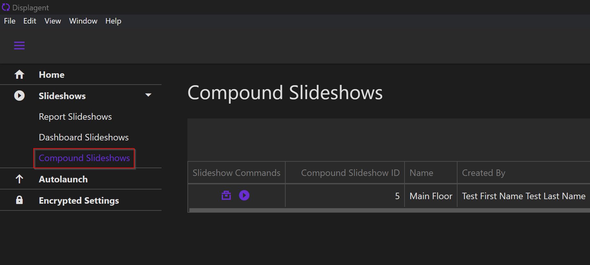

# Compound Slideshows Table

To get to Compound Slideshows, expand the `Slideshows` group on the nav and select **Compound Slideshows**. On this page, you will find a central table/datagrid for all Compound Slideshows that you've created.

  

Here, you can see each Compound Slideshow and the configurations assigned to them. The modifications that you make on this page apply to top-level configurations for each slideshow. To modify the actual content of each Compound Slideshow, you need to visit its respective slideshow build page which you will read more about soon.