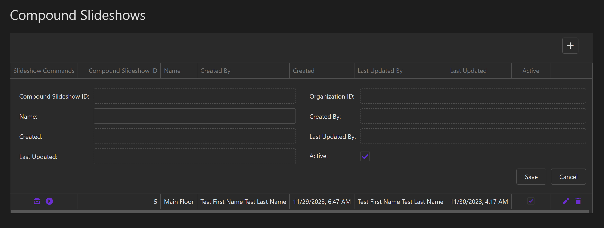

# Create a Compound Slideshow

The following steps below outline how to create a Compound Slideshow and its top-level configurations. 

::: tip
To learn how to build the actual slideshow items, please see the next page.
:::

## Add a new slideshow

On the page with the Compound Slideshows table, click the `+` button in the top-right corner of the table. When you do so, you will see a popup form appear where you can set certain top-level configurations for the slideshow.

  

## Slideshow Configurations

* `Name`: an optional name to assign to the slideshow.

After choosing each configuration, click the `Save` button.