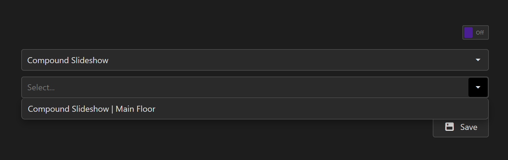

# Launch Compound Slideshow

To launch a Compound Slideshow, you have three options:
* Launch the slideshow from the `Launch Compound Slideshow` button on the Compound Slideshow build page.
* Launch the slideshow from the slideshow's `play` button on the Compound Slideshows Table.
* Designate the Compound Slideshow on Displagent's autolaunch page.

## Slideshow Control Panel

There are three buttons on a Compound Slideshow's build page, namely:
* `Launch Compound Slideshow`
* `Stop Compound Slideshow`
* `Reembed Items`

We describe their behaviors below.

### Launch Compound Slideshow

When a Compound Slideshow is launched, it works through the list of Compound Slideshow items from top to bottom. It starts with the first item and initiates its slideshow by entering fullscreen mode.

::: tip
For Report Slideshows, the Compound Slideshow also executes the refresh action against the Power BI report.
:::

Once the subslideshow reaches the end of its cycle, the Compound Slideshow exits fullscreen mode on the current subslideshow and immediately launches fullscreen mode on the next subslideshow. Then the same steps continue and loop indefinitely until the Compound Slideshow is stopped.

::: tip
For subslideshow types such as Dashboard Slideshows that do not have a definitive end to their slideshow cycles, the `Duration` field for the subslideshow marks the end of the its slideshow cycle.
:::

You will notice that the `Launch Compound Slideshow` button and `Stop Compound Slideshow` button are disabled until all of the subslideshows are successfully embedded onto the page. That same behavior occurs if the Compound Slideshow is autolaunched, as well.

### Stop Compound Slideshow

When a Compound Slideshow is stopped, it exits fullscreen mode on the current subslideshow and returns to a standby mode. If the Compound Slideshow is relaunched, it will restart with the first item in the item list.

::: tip
Remember, if you ever want to exit fullscreen mode for any slideshow, simply press the `Escape` key.
:::

### Reembed Items

When the `ReembedItems` button is clicked, all of the subslideshows are reembedded onto the build page.

## Slideshow Play Button

On the main Compound Slideshows Table, in the `Slideshow Commands`/`Commands` column, there is a `play` button. Clicking this `play` button automatically navigates to the Compound Slideshow's build page and autolaunches the Compound Slideshow.

    

## Autolaunch

And finally, you can designate Displagent's autolauncher to automatically launch a specific Compound Slideshow on machine boot. To do so:

1. Go to the Autolaunch page on the nav.
2. Choose `Compound Slideshow` for the slideshow type.
3. Choose the specific Compound Slideshow that you want to autolaunch.
4. Make sure the autolaunch toggle is set to `on`.
5. Click the `Save` button.

    

