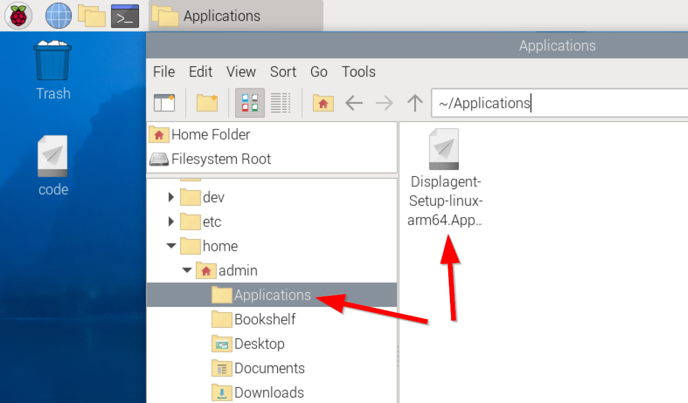
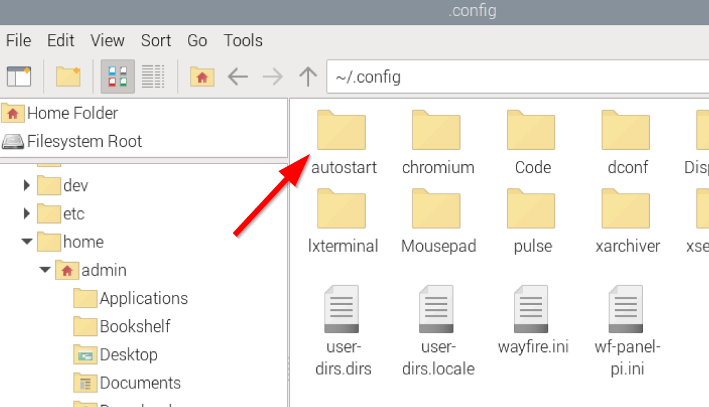
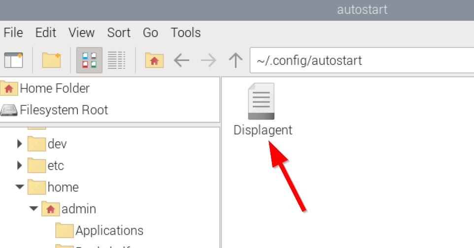
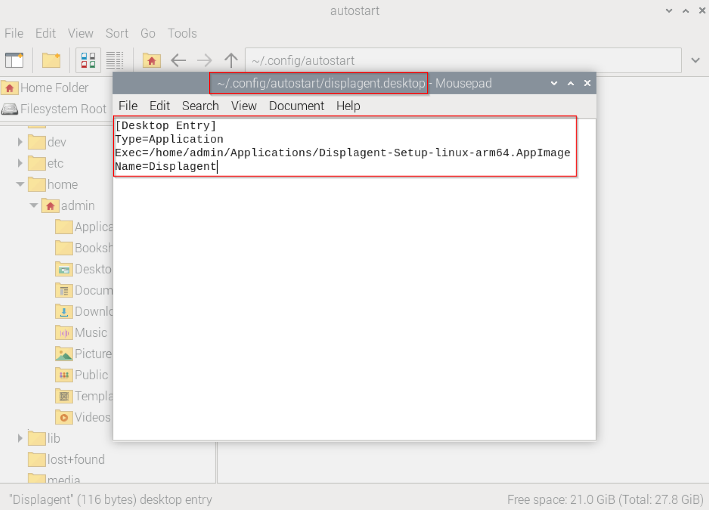

# Autostart

Displagent is designed to automatically start itself on machine startup/reboot. This feature is meant to be combined with the [Autolaunch](/autolaunch/) feature to give you an automatic slideshow activation experience on machine startup/reboot. You will want this feature on your Displagent installations, so pay close attention.

::: warning Autostart ≠ Autolaunch
Please note that Autostart and Autolaunch are **two distinct features** in Displagent. Autostart is responsible for simply opening the app on machine startup/reboot. Autolaunch, on the other hand, is responsible for automatically launching a slideshow of your choosing *after the app is opened by Autostart*.
:::

## Windows

On Windows devices, Autostart is enabled by default and **does NOT require any configuration on your part**.

## Raspberry Pi

On Linux devices such as a Raspberry Pi, Autotstart requires a little manual configuration on your part. Please follow the steps below to enable Autostart on your device:

::: tip
On your Raspberry Pi, you will have an account that you login with to use the device. On my Raspberry Pi, my default account is called `admin`.

Please note that whenever you see the tilde character `~`, this is a shortcut for `/<Your User>/home/`. In my case, for example, `~/.config` would result to `/home/admin/.config/`.
:::

1. Open the file explorer, and navigate to `~`. In my case, since my user is named `admin`, this would take me to `/home/admin`.
2. Create a new folder called `Applications`.

::: tip What is this?
Displagent is an `.AppImage` file on Linux devices, which means it is not a "typical" installed app or package. The [official AppImage website](https://docs.appimage.org/user-guide/faq.html#question-where-do-i-store-my-appimages) recommends creating an `Applications` folder in your home directory to easily track AppImages, hence this step.
:::

3. Move your Displagent `.AppImage` file into your new `Applications` folder.

<p align="center">
    
</p>

4. In the file explorer, navigate to `~/.config`.
5. Inside of the `~/.config/` folder, create a new folder called `autostart`.

<p align="center">
    
</p>

6. Navigate inside of the `~/.config/autostart` folder, and create a new file called `Displagent.desktop`.

<p align="center">
    
</p>

7. Right-click the `Displagent.desktop` file and choose `Open with a text editor`. A simple text editor will do, you don't need anything fancy.
8. Inside of the text editor, please copy and paste the following lines below. However, please note that YOU MUST REPLACE `admin` with the name of your user. Unfortunately, typing `~` will not work here as the command requires an absolute path.

```
[Desktop Entry]
Type=Application
Exec=/home/admin/Applications/Displagent-Setup-linux-arm64.AppImage
Name=Displagent
```

<p align="center">
    
</p>

9. Save and close the `Displagent.desktop` file, and voila! Your device now has Autostart configured!


::: warning Don't forget
Please don't forget to **enable execution permissions** on your `.AppImage` file. Go back to the [Download and Install](/setup/download-and-install#appimage-installation) page if you skipped this part.
:::