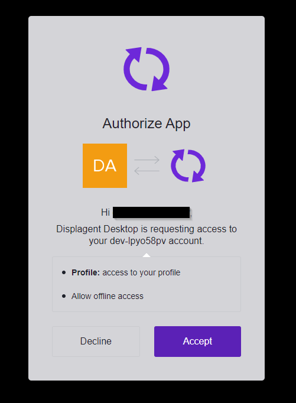

# Download and Install

Since Displagent is a cross-platform desktop application, you will need to download and install it on your machine. Here is a brief guide on how to do that.

## Download Displagent

To download Displagent, please visit the main site's [download page](https://www.displagent.io/download) and click the download icon that is appropriate for your machine's operating system.

::: tip
To confirm that you have downloaded the correct file type for your machine, please look to the file extension reference table below.
:::

| Operating System | File Extension | Status |
| :---: | :---: | :---: |
| Windows | `.exe` | Supported |
| Mac OS | `.dmg` | Contact me if interested |
| Linux | `.AppImage` | Supported |

## Raspberry Pi

If you plan to run Displagent on a Raspberry Pi, please see the requirements below.

### Architecture

Please install the **64-bit version of Raspberry OS (formerly called Raspbian)** on your Raspberry Pi. This is because the `.AppImage` executable is built on a 64-bit Ubuntu virtual machine.

::: danger Verify your OS is 64-bit
Please ensure that you *are* in fact running the 64-bit version of Raspberry OS. The 32-bit version of Raspberry OS can be paired with the 64-bit version of the Raspberry kernel, and this can be **extremely misleading**.

Previously, I would suggest opening a terminal and typing in the command `uname -m`, and if the terminal displayed `aarch64` anywhere, then you should be good. However, I have since learned that this command is not entirely accurate.

Instead, *to verify that you are running the 64-bit version of Raspberry OS*, open a terminal and type in the command `file -L /bin/ls`. When you enter this command, a long string of text should appear in the terminal, and somewhere in the beginning of the text string, you should see either `32-bit` or `64-bit`.
:::

### Models

I recommend the [Raspberry Pi 4 Model B (8 GB)](https://www.raspberrypi.com/products/raspberry-pi-4-model-b/) or higher. At the time of updating this doc, the [Raspberry Pi 5](https://www.raspberrypi.com/products/raspberry-pi-5/) is also now available.

Users have found that Displagent runs extremely well on Raspberry Pis with 8 GB of RAM and is my default recommendation for RAM capacity. This is mainly due to the memory load that comes from loading your Power BI reports and Power BI dashboards in `<iframe>` HTML elements, they are fairly heavy browser visualizations.

## Install Displagent

To install Displagent, simply open/run the executable file. Displagent will install itself on your machine **relative to your user account**, so it is unlikely that you will require admin permissions to install.

::: tip
For example, on Windows, the default installation path will be: `C:\Users\<user>\AppData\Roaming\Displagent`.
:::

### AppImage Installation

If you are installing Displagent on a Linux machine (such as a Raspberry Pi), then you may need to do two things:

1. Right-click the `.AppImage` file and **enable execution permissions**. You can also do this from the terminal by running `chmod +x Displagent-Setup-linux-arm64.AppImage`. See this [AppImage guide](https://docs.appimage.org/introduction/quickstart.html) for an example.
2. If the `.AppImage` file will still not execute, your machine may need to have the `libfuse2` package installed (`AppImages` are known to rely on this package). To install, open a terminal and run `sudo apt install libfuse2`.

::: warning Important
If you are running Displagent on a Raspberry Pi, you may need to run step #2.
:::

::: danger AppImage won't execute
If, after downloading the `.AppImage` file and enabling its execution permissions, you find that Displagent will not even load or open at all, then you may be accidentally running a 32-bit version of Raspberry OS.

Remember, you **must** be running a 64-bit OS, as Displagent **will NOT** run on a 32-bit machine. See the section above for more information.
:::

## Signup

When you first signup for Displagent inside the app, you will likely be met with an Accept/Decline popup from the Displagent authentication system. Please click the `Accept` button to continue with your account creation.

::: tip What is this?
Displagent uses a highly-secure, highly-regulated, and well-established third-party authentication system called [Auth0](https://www.auth0.com). This popup is a mandatory signup requirement from Auth0 when using a desktop app like Displagent, don't let it alarm you.
:::

    

