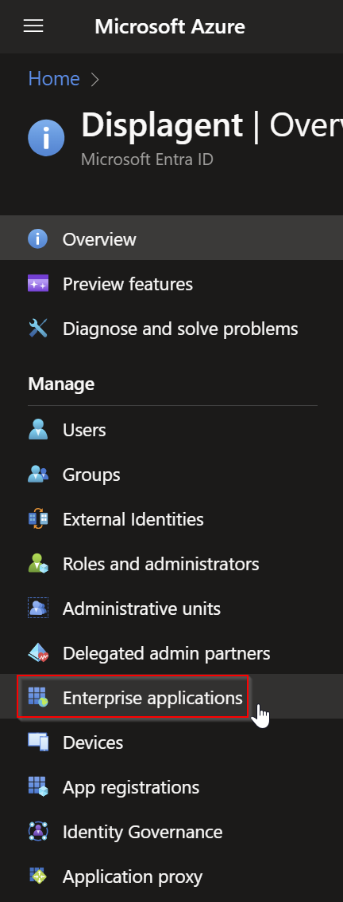
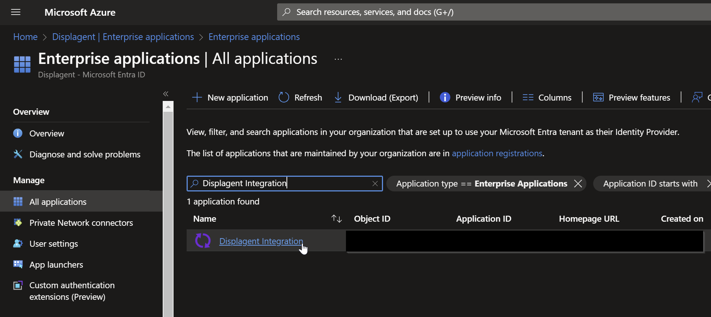
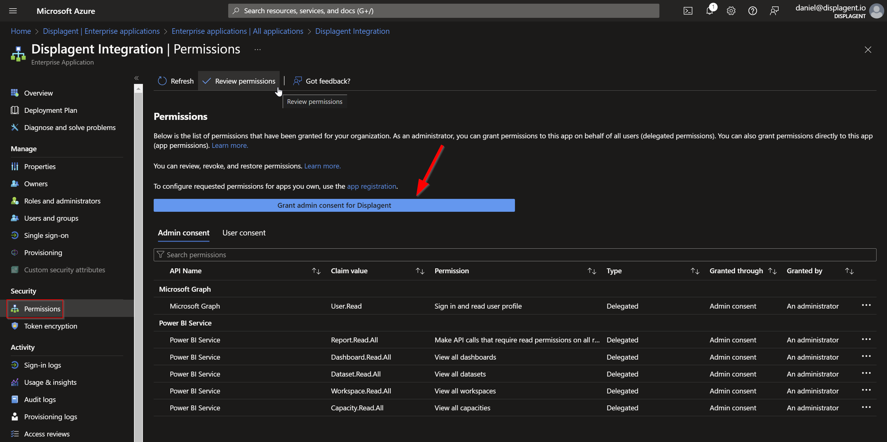

# Microsoft Entra Consent

This is a detailed guide on how to grant consent to Displagent through Microsoft Entra ID in the Azure portal.

If you had to send a request consent message to your company's IT department, then please refer them to this guide as necessary.

## Granting Consent

1. First go to the Azure portal.
2. Navigate to the Microsoft Entra ID service.
3. Go to `Enterprise Applications` using the left-side nav menu.

    

4. Once inside of `Enterprise Applications`, find the application entitled `Displagent Integration`. Click on this application.

    

5. Once inside of `Displagent Integration`, use the left-side nav menu to go to the `Permissions` tab.
6. You should see a `Grant admin consent` button. Please click this button to authenticate Displagent to your Azure tenant.

    

If you are concerned about what permissions Displagent is reqesting, then please review the permissions listed on this page.

::: tip
Remember: Displagent only **reads** the *metadata* of your Power BI artifacts and embeds them onto a page, it **does not** *write* any data to your Power BI tenant.
:::