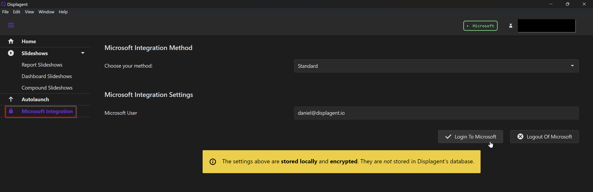
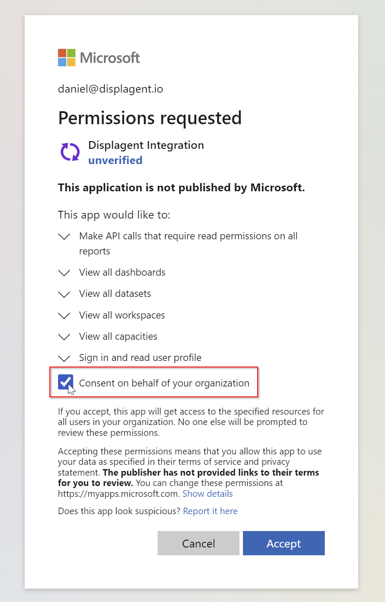
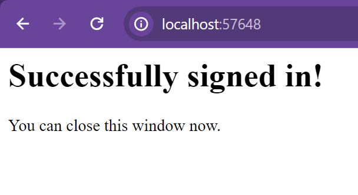

# Standard Integration

This is the detailed guide for setting up the Standard Microsoft Integration in Displagent.

## Login

First off, open up Displagent, open the left-side nav menu, and go to the Microsoft Integration page.

::: tip
When you visit the page, you should automatically have the `Standard` integration method selected unless you previously setup the Advanced Integration.
:::

You will see a Microsoft User textbox that should indicate you are not currently logged in to Microsoft. To login, please click the `Login To Microsoft` button.

Clicking this button *will open up a new tab on your machine's default browser*, so please lookout for a new browser tab appearing on your screen. Once the browser tab loads, you will likely see a Microsoft login page. Please proceed with the Microsoft login.

::: tip MFA
And yes, multi-factor authentication (MFA) will work just fine here. :)
:::

### Service Account

Please use a Microsoft account with an appropriate Power BI license assigned to it. I would also **strongly recommend** using a service account so that Displagent's service is not interrupted in case the authenticating employee leaves your company. A service account is *not* required, but I do recommend using one if you are able.

## Grant Consent

If this is your first time logging into Microsoft with the Standard Integration, then you will likely be met with a consent required dialog box during your Microsoft login process.

The dialog box should list the required permissions for Displagent, and below the permissions will be either:
* A checkbox allowing you to grant `Consent on behalf of your organization`, or
* A request consent area where you can type a request message to your IT department.

::: tip What am I consenting to?
If you or your IT department are wanting to know what permissions Displagent is requesting consent to, just expand the required permissions dropdowns to have a look.

Remember: Displagent only **reads** the *metadata* of your Power BI artifacts and embeds them onto a page, it **does not** *write* any data to your Power BI tenant.
:::

If you see the `Consent on behalf of your organization` checkbox, please go ahead and check that box and click the `Accept` button.

If you need to request consent from your IT department, please type a useful message for them and send the request. I have provided a [Microsoft Entra ID Consent Guide](/setup/microsoft-entra-consent) for your IT department on the following page in case they need to do the consent process for you.

## Successful Login

Once consent has been granted to Displagent by either you or your IT department, then you should be met with a success message after logging into Microsoft. Once you see this message in the browser tab, the authentication process is finished: you can close the browser tab and return to Displagent.

Congratulations, you have integrated with Microsoft successfully! Time to get building!

## Switching From Advanced

If you are currently using the Advanced Integration, but you want to switch to the Standard Integration, please do the following:

* Go to Help > Delete Advanced Credentials from the Help menu at the top.
* Go back to the Microsoft Integration page and select `Standard` for the method if it is not selected already.
* Proceed with the steps mentioned above.