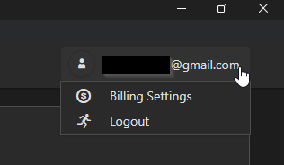
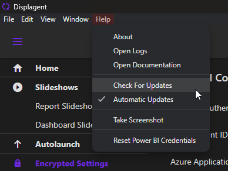

# Utilities and Help

There are some utilities and help links included in Displagent for housekeeping and troubleshooting.

## Settings Menu

When you click your email in the upper right-hand corner of the app, a dropdown menu with several settings will appear. Their actions are listed below:

    

* `Billing Settings`: opens the billing portal on your machine's default browser.

::: tip
The billing portal is currently hosted in Stripe. To login to your billing portal, Stripe will ask you to enter your email address. After submitting your email, Stripe will send you an email with a temporary link that you can click to login to the billing portal.
:::

* `Logout`: logs you out of the app and shuts the app down.

## Help Menu

There is a help menu on the titlebar of the app. Below are its links and their usages:

    

* `About`: opens a dialog box with metadata about the app (e.g. version).
* `Open Logs`: automatically opens the file explorer on your system to the logs folder.
* `Open Documentation`: automatically opens the Displagent docsite in your default browser.
* `Check For Updates`: manually checks for an updated version of Displagent. The result is shown in a popup dialog box.
* `Automatic Updates`: a toggle that activates/deactivates an automatic updates loop within the app. If activated and if an update is found, the following will occur automatically/without user interaction:
    1. Displagent will autodownload its new version in the background.
    2. Displagent will shut itself down.
    3. The new version will be automatically installed on your machine.
    4. Displagent will relaunch itself under the new version.
* `Take Screenshot`: automatically takes a screenshot of the Displagent window and autocopies it to your clipboard for convenience.
* `Reset Power BI Credentials`: deletes the local `powerbiconnectionsettings.json` file.

::: warning
Deleting the `powerbiconnectionsettings.json` file *will* break the app. You will need to enter new credentials afterwards in order for the app to work again.
:::